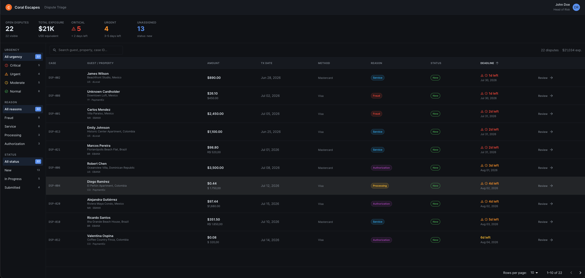

# Dispute Triage Cockpit

A dispute triage dashboard for **Coral Escapes**, a vacation rental marketplace processing $40M+/month across 12 countries in Latin America and the Caribbean. The dashboard helps fraud analysts quickly triage chargebacks, understand each case, and gather the right evidence to win disputes — in under 5 minutes per dispute.

> **Problem it solves:** A 23% dispute win rate (vs. a 45–55% industry benchmark), with analysts spending ~45 min/dispute gathering evidence across 5 systems — losing an estimated $180K/month in winnable chargebacks.

---

## Preview



### Demo

https://github.com/rafael8lopes/ai-challenge/raw/main/src/assets/screen-record.mov

## Features

- **Triage list view** — every dispute at a glance with amount, reason, status, and a color-coded deadline urgency indicator.
- **Filter & sort** — by deadline, amount, reason category, and status, plus free-text search across customer, property, and dispute ID.
- **Summary metrics** — at-a-glance totals to prioritize the queue.
- **Dispute detail workspace** — transaction data, customer profile, booking details, and a chronological case timeline.
- **Plain-language reason codes** — every chargeback reason code translated into an analyst-friendly explanation.
- **Contextual evidence guidance** — evidence checklist, case strength assessment, and risk signals tailored to each dispute's reason category.

## Tech Stack

| Layer | Choice |
|-------|--------|
| Framework | React 19 |
| Language | TypeScript 6 (strict) |
| Build | Vite 8 |
| UI | MUI 6 + Emotion + Sass |
| Routing | React Router DOM 7 |
| Data fetching | TanStack React Query 5 |
| Linting | ESLint 10 + typescript-eslint |
| Package manager | npm |

## Getting Started

### Prerequisites

- Node.js 20+ (LTS recommended)
- npm 10+

### Installation

```bash
npm install
```

### Available Scripts

```bash
npm run dev      # Start the Vite dev server (default: http://localhost:5173)
npm run build    # Type-check and produce a production build
npm run preview  # Preview the production build locally
npm run lint     # Run ESLint
```

## Project Structure

```
src/
├── app/                    # App-level setup (MUI theme)
├── assets/                 # Static assets
├── components/             # Shared/reusable UI components (AppHeader)
├── features/
│   └── disputes/
│       ├── components/     # Dispute UI: card, filters, table, sidebar, detail cards
│       ├── hooks/          # useDisputes, useDisputeDetail, useDisputeFilters
│       ├── pages/          # DisputeListPage, DisputeDetailPage
│       ├── services/       # disputeService (mock async data layer)
│       ├── types/          # Feature type definitions
│       └── utils/          # formatters, reasonCodes, caseAssessment, styles
├── mocks/                  # Mock dispute dataset
├── App.tsx                 # Router + providers
└── main.tsx                # Entry point
```

## Architecture & Design Decisions

- **Feature-based structure.** All dispute logic lives under `src/features/disputes`, keeping components, hooks, services, and types colocated for a clear public surface and easy scaling.
- **Mock data behind a service layer.** There is no real backend. `disputeService` wraps an in-memory dataset (22 disputes) and simulates network latency, so the UI exercises real async loading/error states via TanStack Query. Swapping in a real API later means changing only the service.
- **Server state vs. UI state.** TanStack Query owns fetched data (caching, loading, retries); local component state (`useState`) handles filter and UI interactions.
- **Client-side filtering & sorting.** Search, urgency, reason category, status, and sort options are applied in the service layer against the mock dataset — mirroring how a server query would behave.
- **Urgency as a first-class signal.** Deadline proximity is derived (`getUrgencyLevel`) and surfaced with color coding, because deadline visibility is the analyst's most time-sensitive concern.
- **Contextual evidence intelligence.** Reason codes are mapped to plain-language explanations (`reasonCodes`) and the detail view assesses case strength and surfaces category-specific evidence and risk signals (`caseAssessment`).
- **MUI theme + `sx`.** All styling goes through the MUI theme system and `sx`/`styled` for consistency and a professional, operational tone (clarity over density).
- **Strict TypeScript, named exports.** Functional components only, `interface` for object shapes, `type` for unions — no `any`.

## Domain Model

The core entity is the `Dispute`, which aggregates:

- **Transaction** — amount, currency, processor, auth code, IP, device fingerprint, AVS/CVV match.
- **Customer** — profile, booking history, and prior dispute count.
- **Booking** — property, stay dates, host, and cancellation policy.
- **Timeline** — chronological events from booking creation to dispute filing.
- **Evidence signals** — available/missing evidence with strength ratings.

### Reason Code Reference

| Code | Category | Meaning |
|------|----------|---------|
| 10.4 / 10.5 | Fraud | Fraudulent / counterfeit card-not-present transaction |
| 13.1 / 13.2 / 13.3 | Service | Not provided, cancelled recurring, or not as described |
| 12.1 / 12.2 | Processing | Duplicate processing or incorrect amount |
| 11.1 / 11.3 | Authorization | Card recovery bulletin or no authorization obtained |

### Evidence Strategy by Category

- **Fraud (10.x):** IP match, device fingerprint, delivery confirmation, prior successful transactions, AVS/CVV match.
- **Service (13.x):** Check-in/out logs, guest communication, cancellation policy acceptance, property photos.
- **Processing (12.x):** Transaction logs proving a single charge and correct amount.
- **Authorization (11.x):** Auth response codes and approval records.

---

# Development Process

## Brainstorming

For brainstorming and as a sparring partner I used ChatGPT.

## UI/UX

I used Figma AI chat to create the visuals for this application.

## Coding

I used GitHub Copilot with Claude Opus 4.8 for coding.
